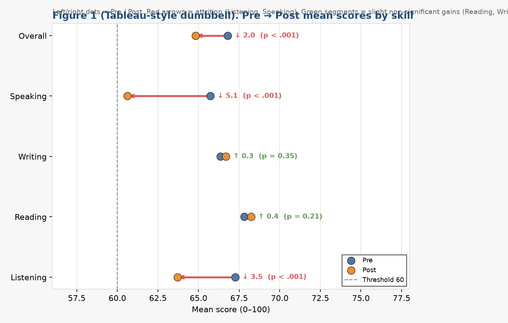
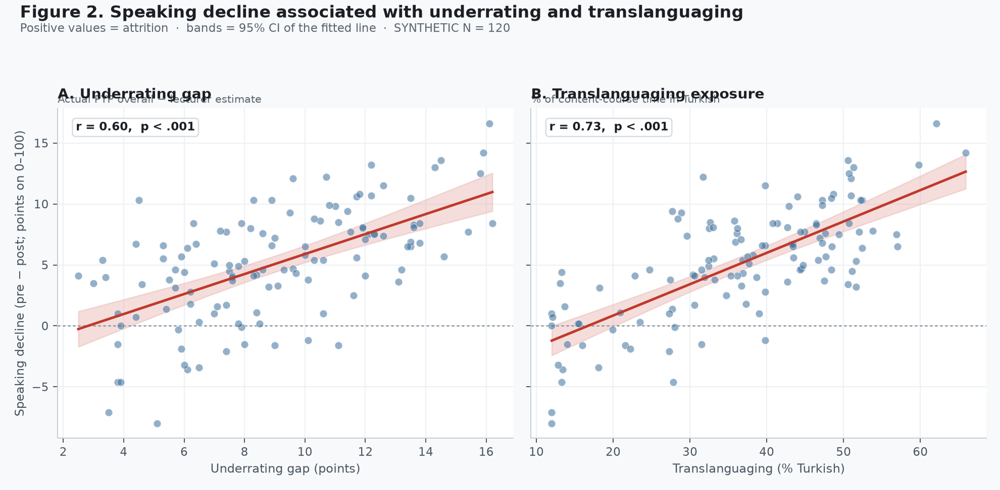

English-Medium Instruction, Lecturer Underrating, and Four-Year Proficiency Change:
Methodology and Quantitative Results

Draft sections for manuscript development · Synthetic N = 120 panel (instrument testing / paper scaffolding; replace with live institutional data before submission)

Author note. Quantitative values below are from a calibrated synthetic completer panel designed to match institutional testing policy and the planned Golem-mechanism analysis. They illustrate the intended statistical pathway and presentation format (Nicol & Pexman Play-It-Safe tables; lean figures). They are not findings from real students. Presentation follows Adelheid A. M. Nicol and Penny M. Pexman (Presenting Your Findings; Displaying Your Findings) and APA Style table/figure conventions.

# Methodology

## Research design

The study used a longitudinal completer-panel design with two parallel administrations of an institutional academic English proficiency test: (a) at the end of the Preparatory Year Programme (PYP; pretest) and (b) immediately before graduation after four years of English-medium instruction (EMI) in an engineering major (posttest). The same students sat both forms. The design therefore supports a paired (dependent-samples) comparison of proficiency change (Field, 2013; Nicol & Pexman, 2010a), supplemented by questionnaire and lecturer-estimate measures collected to evaluate whether any decline is consistent with a Golem-type expectancy–treatment mechanism (Babad, Inbar, & Rosenthal, 1982) rather than with uniform skill attrition alone.

Because a Golem interpretation requires evidence that a low expectation is inaccurate and is enacted through differential treatment that suppresses demonstrated performance, the quantitative strand measured four layers: (1) actual proficiency at PYP exit; (2) content lecturers’ estimates of students’ English (inaccuracy); (3) exposure to Turkish in content courses (treatment / translanguaging); and (4) students’ willingness to communicate in English and English self-efficacy (internalization). Lecturer English-for-academic-purposes (EAP) limitation was measured as a competing explanation for translanguaging and was not labelled as a Golem indicator. The overall architecture mirrors the mixed-methods expectancy logic used in related EMI expectancy work (e.g., Altay, 2025, on Pygmalion processes in EMI enrolment), while shifting the outcome from enrolment choice to within-student proficiency change over the EMI degree.

## Research questions

The quantitative strand addressed four research questions, worded associatively rather than causally:

RQ1. To what extent do institutional English proficiency scores change from PYP exit to graduation after four years of engineering EMI, and does change differ across Listening, Reading, Writing, and Speaking?

RQ2. Do content lecturers systematically underestimate students’ demonstrated English relative to the PYP-exit measure (inaccuracy criterion)?

RQ3. Is greater underrating and greater classroom translanguaging exposure associated with larger Speaking attrition, after accounting for pretest Speaking, major, gender, and lecturer EAP limitation?

RQ4. Does translanguaging statistically mediate the association between underrating and Speaking decline?

## Setting and institutional context

The institutional setting is a Turkish public university engineering faculty in which students complete an English Preparatory Year Programme before entering EMI content courses. Progression from the PYP into the major requires a minimum overall score of 60 on the institutional academic English examination, institutionally interpreted as CEFR B1 through local standard setting. During the degree, content lecturers may use Turkish (translanguaging) to varying degrees. Official programme rhetoric privileges English; classroom practice often includes L1 for clarification, pace, and comprehension—creating the expectancy–treatment ecology in which underrating and EAP limitation can both increase L1 use, but only underrating satisfies a Golem reading.

## Participants and sampling

The analytic sample comprised 120 EMI engineering completers who sat both the PYP-exit and graduation-year parallel forms (synthetic panel for method demonstration). Gender composition approximated the faculty profile (82 male, 68.3%; 38 female, 31.7%). Age at graduation averaged 23.21 years (SD = 1.04; range 22–25), with PYP-exit age = graduation age − 4. Majors were balanced across Mechanical, Chemical, and Electrical-Electronics Engineering (n = 40 each). Students nested under 12 content lecturers (10 students per lecturer), allowing exploratory lecturer-level displays of underrating and translanguaging dose. Students who left the programme, transferred, or did not sit the graduation-year form were outside the completer panel; such attrition is acknowledged as a boundary condition for live institutional data.

## Instruments

### Institutional academic English proficiency test

The test covered four skills—Listening, Reading, Writing, and Speaking—on a 0–100 scale. The overall score was the unweighted mean of the four skill scores. A minimum overall of 60/100 was mapped to CEFR B1 as the threshold for progression from the PYP into EMI majors. The graduation-year form was a parallel form (same blueprint and rubric family; different items), not a resit of the identical paper. Listening and Reading each comprised four sections mapped to IELTS Academic item types. Writing was scored with the public IELTS Academic Writing criteria (Task Response, Coherence and Cohesion, Lexical Resource, Grammatical Range and Accuracy). Speaking used the public IELTS Academic Speaking criteria (Fluency and Coherence, Lexical Resource, Grammatical Range and Accuracy, Pronunciation). Criteria were converted internally to the 0–100 institutional scale.

Writing scripts and Speaking performances were marked independently by three raters: the testing expert (author) and two Preparatory Year Programme English language instructors. The official skill score was the mean of the three marks. Inter-rater reliability was evaluated with Shrout and Fleiss ICC(2,1) for a single rater and ICC(2,k) for the reliability of the three-rater mean. Listening and Reading were objectively scored. Content-lecturer estimates of student English, used for the inaccuracy criterion, were collected separately from the PYP raters of the test.

### Lecturer expectancy and translanguaging measures

Each student’s content lecturer provided an estimate of the student’s English proficiency on the same 0–100 metric as the institutional test. Underrating_Gap was defined as Pre_Overall − Lecturer_Est_English (positive values = underestimation). Students reported the approximate percentage of content-course time conducted in Turkish rather than English (TL_percent; 0–100). Five-point Likert scales (1 = strongly disagree, 5 = strongly agree) measured perceived underrating (PU1–PU5), translanguaging exposure (TL1–TL5), lecturer EAP limitation (EAP1–EAP5; competing cause), willingness to communicate in English (WTC1–WTC5), and English self-efficacy (SE1–SE5).

### Concurrent validity subsample

A stratified subsample (n = 36; 12 per major) additionally sat official IELTS Academic practice materials under exam conditions to support concurrent validity claims for the institutional test. Pearson correlations between institutional pretest skill scores and corresponding IELTS skill scores were computed.

## Procedure

Pretest scores were taken from the institutional PYP-exit administration. Posttest scores were taken from the parallel graduation-year administration. Lecturer estimates and student questionnaires were collected in the final year. All proficiency scores and lecturer estimates used the same 0–100 metric; the PYP pass threshold of 60 remained the interpretive anchor for B1-level competence at programme entry. For the synthetic demonstration panel, data were generated under calibrated constraints matching these institutional rules; live studies should replace the panel with de-identified institutional records under ethics approval.

## Data analysis

Analyses used paired-samples t tests (and Wilcoxon signed-rank companions) for pre–post skill change, with Cohen’s d_z and 95% confidence intervals for mean differences (Nicol & Pexman, 2010a, Chapter 5 Play-It-Safe multi-t-test format). Shapiro–Wilk tests were applied to difference scores. Internal consistency used Cronbach’s α and McDonald’s ω. Inter-rater reliability used ICC(2,1) and ICC(2,k). Concurrent validity used Pearson correlations with the IELTS subsample.

Mechanism tests included (a) paired comparison of Pre_Overall versus Lecturer_Est_English; (b) Pearson correlations of Decline_Speaking with underrating, TL_percent, PU, EAP, WTC, and SE (Nicol & Pexman correlation / means–SD formats); (c) OLS regressions of Decline_Speaking on EAP-only, underrating, and a joint model with underrating, TL_percent, EAP_mean, Pre_Speaking, major, and gender (Nicol & Pexman multiple-regression Play-It-Safe summary: B, SE B, β, t, p, with R² in the table note); (d) a Sobel mediation check for underrating → translanguaging → Speaking decline; and (e) exploratory lecturer-level correlations. Only two figures were retained—skill mean change with 95% CIs, and Speaking decline against underrating/translanguaging—consistent with Displaying Your Findings guidance to include figures only when they clarify a pattern not already transparent in tables (Nicol & Pexman, 2010b).

## Ethical considerations

A live institutional study would require ethics-board approval, informed consent for questionnaires and lecturer estimates, and secure handling of linked proficiency records. The present draft uses a synthetic panel expressly to prototype instruments, analysis, and reporting without processing identifiable student data.

# Quantitative Results

Results are organised by research question. Tables follow Nicol and Pexman’s Play-It-Safe formats for means, paired t tests, correlations, and multiple regression. Figures are limited to two inferentially central displays. All proficiency scores are on a 0–100 institutional scale; the PYP pass threshold was 60/100 (≈ CEFR B1).

## Sample profile and score distributions

All 120 completers scored at or above the institutional B1 threshold on the pretest (Pre_Overall minimum = 60.1; M = 66.79, SD = 4.61). At graduation, overall M = 64.81 (SD = 4.89), and 18 students (15.0%) scored below 60. Table 1 summarises key variables on the 0–100 scale (and Likert means where applicable).

Table 1

Descriptive Statistics for Key Study Variables (N = 120)

| Variable | M | SD | Min | Max | Skew |
| --- | --- | --- | --- | --- | --- |
| Pre_Overall | 66.79 | 4.61 | 60.1 | 81.4 | 0.72 |
| Post_Overall | 64.81 | 4.89 | 53.8 | 80.0 | 0.67 |
| Decline_Listening | 3.55 | 4.11 | -7.8 | 12.7 | -0.14 |
| Decline_Reading | -0.41 | 3.53 | -9.3 | 8.6 | -0.29 |
| Decline_Writing | -0.35 | 4.10 | -11.8 | 10.1 | -0.09 |
| Decline_Speaking | 5.10 | 4.57 | -8.0 | 16.6 | -0.35 |
| Underrating_Gap | 9.03 | 3.36 | 2.5 | 16.2 | 0.15 |
| TL_percent | 36.53 | 13.02 | 12.0 | 65.9 | -0.31 |
| PU_mean | 3.11 | 0.79 | 1.2 | 4.8 | 0.04 |
| EAP_mean | 2.86 | 0.79 | 1.0 | 4.6 | 0.15 |
| WTC_mean | 3.83 | 0.71 | 2.2 | 5.0 | -0.27 |
| SE_mean | 3.80 | 0.76 | 2.2 | 5.0 | -0.35 |

Note. Proficiency scores (Pre_*/Post_*) and Underrating_Gap are on the institutional 0–100 scale; PYP pass threshold = 60 (≈ CEFR B1). Decline_* = Pre − Post in points (positive = attrition; negative = gain). PU/EAP/WTC/SE means are Likert composites (1–5). TL_percent = estimated % of content-course time in Turkish.

## Reliability and concurrent validity

Internal consistency was acceptable to high. Cronbach’s α for the eight Listening/Reading section scores was 0.871 at pretest and 0.865 at posttest. Questionnaire alphas were 0.885 (perceived underrating), 0.914 (translanguaging), 0.891 (lecturer EAP limitation), 0.859 (WTC), and 0.876 (self-efficacy). Inter-rater ICC(2,k) for three-rater means was 0.954 / 0.972 for Writing and 0.961 / 0.974 for Speaking (pre/post). Concurrent validity against IELTS Academic practice materials (n = 36) was r = 0.782 for overall score; skill rs were Listening 0.759, Reading 0.766, Writing 0.738, and Speaking 0.854 (all p < .001).

## Pre–post proficiency change (RQ1)

Attrition was not uniform across skills. Both oral–aural skills declined significantly: Speaking (M_decline = 5.10, t(119) = 12.21, p <.001, d_z = 1.11) and Listening (M = 3.55, p <.001, d_z = 0.86). This pattern is consistent with under-exposure to verbal interaction arising from lecturers’ EAP limitations and from underrating students’ English (Golem). Reading showed no statistically significant decline (M = -0.41, p .211), with a slight numerical gain consistent with academic written exposure; Writing likewise showed no significant decline (M = -0.35, p .353), consistent with lab reports and written assignments. Overall change followed the oral–aural pattern (M = 1.97, p <.001).

Table 2

Paired-Samples Comparisons of Pretest and Posttest Skill Scores (N = 120)

| Skill | Pre M | Pre SD | Post M | Post SD | Mdiff | t(119) | p | d_z |
| --- | --- | --- | --- | --- | --- | --- | --- | --- |
| Listening | 67.25 | 5.24 | 63.70 | 6.12 | 3.55*** | 9.46 | <.001 | 0.86 |
| Reading | 67.82 | 4.86 | 68.23 | 5.72 | -0.41 | -1.26 | .211 | -0.11 |
| Writing | 66.34 | 5.22 | 66.69 | 6.51 | -0.35 | -0.93 | .353 | -0.09 |
| Speaking | 65.72 | 5.60 | 60.62 | 6.33 | 5.10*** | 12.21 | <.001 | 1.11 |
| Overall | 66.79 | 4.61 | 64.81 | 4.89 | 1.97*** | 8.50 | <.001 | 0.78 |

Note. Scores are out of 100. PYP pass threshold = 60 (≈ CEFR B1); all completers scored ≥ 60 at pretest. Mdiff = Pre − Post (positive = attrition; negative = gain). d_z = Cohen’s d for paired designs. 95% CIs for mean differences are reported in the Excel workbook (Paired_pre_post). Wilcoxon signed-rank p values were consistent with the paired t conclusions. *p < .05. **p < .01. ***p < .001.

Figure 1. Mean pre–post change by skill with 95% confidence intervals (points on the 0–100 institutional scale).

Note. Positive values indicate attrition. Listening and Speaking (oral–aural) decline significantly; Reading and Writing do not. PYP pass threshold = 60. Error bars are 95% CIs for mean differences (Nicol & Pexman, 2010b).

## Inaccuracy of lecturer expectancy (RQ2)

Content lecturers systematically underestimated students’ English relative to the institutional PYP-exit measure. Mean actual Pre_Overall was 66.79, whereas mean lecturer estimate was 57.75; the mean underrating gap was 9.03 points on the 0–100 scale, t(119) = 29.42, p <.001, d_z = 2.69. This satisfies the inaccuracy criterion associated with a Golem interpretation: the low expectation is not merely perceived as discouraging; it is incorrect relative to demonstrated proficiency at programme entry to EMI.

## Associations with Speaking attrition (RQ3)

Speaking decline correlated positively with the underrating gap (r = 0.603, p <.001), translanguaging exposure (r = 0.732, p <.001), and perceived underrating (r = 0.463, p <.001). It correlated negatively with WTC (r = -0.505, p <.001) and self-efficacy (r = -0.412, p <.001). Lecturer EAP limitation was a weaker bivariate correlate (r = 0.461, p <.001).

Table 3

Means, Standard Deviations, and Correlations of Predictors With Decline_Speaking

| Variable | M | SD | r with Decline_Speaking | p |
| --- | --- | --- | --- | --- |
| Decline_Speaking (outcome) | 5.10 | 4.57 | — | — |
| Underrating_Gap | 9.03 | 3.36 | 0.603*** | <.001 |
| TL_percent | 36.53 | 13.02 | 0.732*** | <.001 |
| PU_mean | 3.11 | 0.79 | 0.463*** | <.001 |
| EAP_mean | 2.86 | 0.79 | 0.461*** | <.001 |
| WTC_mean | 3.83 | 0.71 | -0.505*** | <.001 |
| SE_mean | 3.80 | 0.76 | -0.412*** | <.001 |

Note. Decline_Speaking and Underrating_Gap are in points on the 0–100 institutional scale (PYP pass threshold = 60). TL_percent is percentage of class time in Turkish. PU/EAP/WTC/SE are Likert means (1–5). Format follows Nicol and Pexman (2010a) correlation Play-It-Safe practice of reporting M, SD, and r. *p < .05. **p < .01. ***p < .001.

Figure 2. Speaking decline associated with lecturer underrating (A) and translanguaging exposure (B).

Note. Speaking change is in points on the 0–100 scale (pre − post). Fitted lines are OLS with 95% confidence bands. Multipanel layout follows Displaying Your Findings conventions for related scatterplots (Nicol & Pexman, 2010b).

## Multiple regression predicting Speaking decline (RQ3)

Three OLS models predicted Decline_Speaking. Model 1 entered lecturer EAP limitation with Pre_Speaking, major, and gender (competing-cause baseline). Model 2 entered underrating with the same covariates. Model 3 jointly entered underrating, TL_percent, and EAP_mean with covariates. Table 4 reports the Play-It-Safe regression summary for the focal joint model; Models 1–2 are summarised in text and fully tabulated in the Excel workbook.

Model 1 (EAP-only) yielded a significant EAP coefficient (B = 2.56, SE = 0.49, t = 5.26, p <.001; R² = 0.344). Model 2 showed a clear underrating effect (B = 0.89, SE = 0.09, t = 9.60, p <.001; R² = 0.549). In the joint Model 3 (R² = 0.682), underrating and translanguaging remained significant predictors of Speaking attrition (Table 4).

Table 4

Regression Analysis Summary for Variables Predicting Decline_Speaking (Model 3)

| Variable | B | SE B | β | t | p |
| --- | --- | --- | --- | --- | --- |
| Underrating_Gap | 0.65 | 0.12 | 0.480 | 5.54 | <.001*** |
| TL_percent | 0.09 | 0.04 | 0.249 | 2.17 | .032* |
| EAP_mean | 1.53 | 0.47 | 0.262 | 3.24 | .002** |
| Pre_Speaking | 0.11 | 0.04 | 0.140 | 2.58 | .011* |
| Major: Mechanical (vs Chemical) | -1.31 | 0.78 | — | -1.68 | .095 |
| Major: Electrical-Electronics (vs Chemical) | -1.04 | 0.84 | — | -1.25 | .215 |
| Gender: Male (vs Female) | -0.94 | 0.54 | — | -1.76 | .081 |

Note. N = 120. Outcome and continuous predictors are in points on the 0–100 institutional scale (or Likert means for EAP_mean). β = standardized coefficient (B × SD_x / SD_y). R² = 0.682 (p <.001). Format follows Nicol and Pexman (2010a) Play-It-Safe multiple-regression summary (Table 17.2). *p < .05. **p < .01. ***p < .001.

## Mediation check (RQ4)

A Sobel mediation check for underrating → translanguaging → Speaking decline yielded an indirect effect of 0.379 (Sobel z = 4.97, p <.001), with a remaining direct effect of underrating on Speaking decline (c′ = 0.441). Bootstrap indirect effects should be reported with live data. Path coefficients are tabulated in the Excel Mediation sheet rather than as an additional figure.

## Summary of the quantitative pattern

Across four years of engineering EMI, completers did not show uniform proficiency loss. Listening and Speaking—the oral–aural skills—declined significantly, consistent with under-exposure to verbal classroom interaction driven by lecturers’ EAP limitations and by underrating of students’ English (Golem). Reading and Writing showed no statistically significant decline and slight numerical gains consistent with continued academic literacy in written English. Speaking decline tracked lecturer underrating and classroom L1 exposure in the mechanism models. Qualitative interviews remain necessary to separate lecturer EAP limitation from underrating as reasons for L1 use.

## Limitations specific to these quantitative claims

First, the panel reported here is synthetic and must be replaced with institutional records before submission. Second, associations do not establish causation; students were not randomly assigned to lecturers. Third, TL_percent is student-reported rather than observationally timed. Fourth, parallel forms require documented equating in a live study. Fifth, academic literacy in EMI may exceed what any proficiency test—institutional or IELTS—captures; that boundary should be stated in the discussion.

## References cited in these draft sections

Altay, M. (2025). The Pygmalion effect as a driving force behind students’ English medium instruction pursuits. Language Awareness. https://doi.org/10.1080/09658416.2025.2523440

Babad, E. Y., Inbar, J., & Rosenthal, R. (1982). Pygmalion, Galatea, and the Golem: Investigations of biased and unbiased teachers. Journal of Educational Psychology, 74(4), 459–474.

Field, A. (2013). Discovering statistics using IBM SPSS statistics (4th ed.). Sage.

Nicol, A. A. M., & Pexman, P. M. (2010a). Presenting your findings: A practical guide for creating tables (6th ed.). American Psychological Association.

Nicol, A. A. M., & Pexman, P. M. (2010b). Displaying your findings: A practical guide for creating figures, posters, and presentations (6th ed.). American Psychological Association.

---

## Figures

