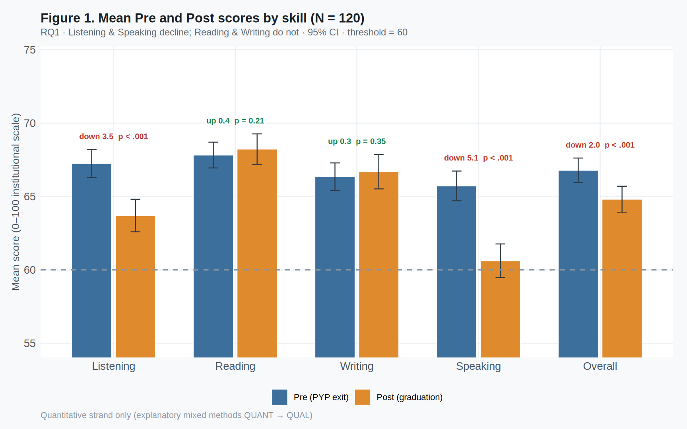

# English-Medium Instruction and Oral–Aural Attrition:
## Methodology and Quantitative Results

Explanatory sequential mixed methods (QUANT → QUAL) · Synthetic N = 120 completer panel (scaffolding; replace with live institutional data). Quantitative strand = **RQ1 only** (paired Pre/Post). Qualitative strands (RQ2–RQ3) are scoped below and developed next.

*Author note.* Values are from a calibrated synthetic panel for method demonstration—not findings from real students. Tables follow Nicol & Pexman Play-It-Safe formats.

## Research questions

**RQ1 (Quantitative).** To what extent do students’ institutional English proficiency scores change from PYP exit to graduation after four years of engineering EMI, across Listening, Reading, Writing, Speaking, and Overall?

**RQ2 (Qualitative — lecturers).** How do content lecturers describe whether and why they use translanguaging in EMI courses?

**RQ3 (Qualitative — students).** How do students experience EMI classroom language practices, and how do they relate those practices to changes in their English proficiency—especially Listening and Speaking?

## Methodology

### Research design

The study adopts an **explanatory sequential mixed-methods** design (Creswell & Plano Clark, 2018). Phase 1 (quantitative) uses a longitudinal completer panel: the same engineering EMI students sat parallel institutional academic English tests at (a) PYP exit (pretest) and (b) graduation after four years of EMI (posttest). Paired comparisons establish whether proficiency changed and in which skills. Phase 2 (qualitative; forthcoming) will interview lecturers and students to explain oral–aural attrition through accounts of translanguaging, materials difficulty, and lecturer/student English use. The qualitative phase is deliberately reserved until after the quantitative comparison is fixed.

### Setting

Turkish public-university engineering faculty with an English Preparatory Year Programme before EMI content courses. Progression requires a minimum overall of **60/100** on the institutional test (≈ CEFR B1). Classroom practice often includes Turkish (translanguaging); that practice is treated here as a phenomenon to be explained qualitatively, not modelled statistically in Phase 1.

### Participants (quantitative)

Analytic sample: *N* = 120 EMI engineering completers with both Pre and Post scores (synthetic demonstration panel). Gender ≈ faculty profile (82 male, 38 female). Majors balanced across Mechanical, Chemical, and Electrical-Electronics Engineering.

### Instrument

Institutional academic English test covering Listening, Reading, Writing, and Speaking on a **0–100** scale; Overall = unweighted mean of the four skills. Graduation form = parallel form (same blueprint/rubrics; different items). Writing and Speaking marked by three raters (testing expert + two PYP instructors); official skill score = mean of three marks.

### Quantitative data analysis (RQ1 only)

Paired-samples *t* tests (Wilcoxon signed-rank companions) for each skill and Overall; Cohen’s *d_z*; 95% CIs for mean differences (Nicol & Pexman, 2010a). Difference-score normality inspected with Shapiro–Wilk. One figure: grouped Pre vs Post means with 95% CIs. **No** mechanism regressions, mediation, underrating indices, or TL% correlations in this strand.

### Qualitative strand (RQ2–RQ3; next)

Lecturer accounts: whether/why they translanguage (often framed as compensating for students’ limited English to protect content learning). Student accounts: materials/lecturer English beyond comprehension and/or lecturers’ EMI proficiency limits; reduced English verbal interaction; felt worsening of Listening/Speaking. Analysis plan: thematic analysis after quantitative results are locked.

## Quantitative results (RQ1)

All completers met the pretest threshold (Pre_Overall minimum = 60.1). At graduation, 18 students (15.0%) scored below 60 overall. Table 1 gives Pre/Post descriptives; Table 2 the paired tests; Figure 1 the Pre/Post means.

### Table 1

*Descriptive Statistics for Pre and Post Proficiency Scores (N = 120)*

| Skill | Pre M | Pre SD | Post M | Post SD |
| --- | ---: | ---: | ---: | ---: |
| Listening | 67.25 | 5.24 | 63.70 | 6.12 |
| Reading | 67.82 | 4.86 | 68.23 | 5.72 |
| Writing | 66.34 | 5.22 | 66.69 | 6.51 |
| Speaking | 65.72 | 5.60 | 60.62 | 6.33 |
| Overall | 66.79 | 4.61 | 64.81 | 4.89 |

Note. Scores on the 0–100 institutional scale. PYP pass threshold = 60 (≈ CEFR B1).

### Table 2

*Paired-Samples Tests of Pre–Post Change (N = 120)*

| Skill | Mdiff | SD | t(119) | p | d_z | 95% CI |
| --- | ---: | ---: | ---: | ---: | ---: | --- |
| Listening | 3.55 | 4.11 | 9.46 | < .001*** | 0.86 | [2.81, 4.29] |
| Reading | -0.41 | 3.53 | -1.26 | = .21 | -0.11 | [-1.04, 0.23] |
| Writing | -0.35 | 4.10 | -0.93 | = .35 | -0.09 | [-1.09, 0.39] |
| Speaking | 5.10 | 4.57 | 12.21 | < .001*** | 1.11 | [4.27, 5.93] |
| Overall | 1.97 | 2.54 | 8.50 | < .001*** | 0.78 | [1.51, 2.43] |

Note. Mdiff = Pre − Post (positive = attrition). *d_z* = Cohen’s *d* for paired designs. *p* < .05. **p* < .01. ***p* < .001.

### Interpretation (quantitative only)

Listening declined significantly (Mdiff = 3.55, *t*(119) = 9.46, *p* < .001, *d_z* = 0.86). Speaking declined significantly and most strongly (Mdiff = 5.10, *t*(119) = 12.21, *p* < .001, *d_z* = 1.11). Reading (Mdiff = -0.41, *p* = .21) and Writing (Mdiff = -0.35, *p* = .35) did **not** decline significantly; both showed small non-significant gains. These oral–aural losses motivate the qualitative phase (RQ2–RQ3) on translanguaging and EMI language practices—not further quantitative mechanism tests.

## Figures

Figure 1. Mean Pre (PYP exit) and Post (graduation) scores by skill with 95% CIs (RStudio / ggplot2). Threshold = 60.

## References (selected)

Creswell, J. W., & Plano Clark, V. L. (2018). *Designing and conducting mixed methods research* (3rd ed.). SAGE.

Field, A. (2013). *Discovering statistics using IBM SPSS Statistics* (4th ed.). SAGE.

Nicol, A. A. M., & Pexman, P. M. (2010a). *Presenting your findings: A practical guide for creating tables* (6th ed.). APA.

Nicol, A. A. M., & Pexman, P. M. (2010b). *Displaying your findings: A practical guide for creating figures, posters, and presentations* (6th ed.). APA.
