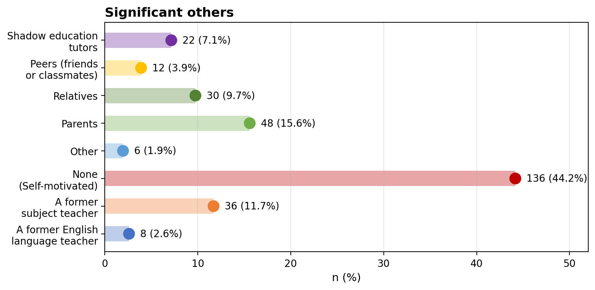

# Perceived External Discouragement and the Avoidance of English-Medium Instruction in Turkish Higher Education

## Abstract

Universities in many countries now offer English-medium instruction (EMI) alongside first-language programmes, yet a sizeable number of students prefer to study in their mother tongue. Existing research has emphasised individual factors such as proficiency, cost, and imagined career return, paying less attention to dissuasive influence from significant others when medium of instruction is chosen. This mixed-methods study examined why undergraduates at three state universities in Türkiye preferred Turkish-medium instruction (TMI) over EMI, focusing on **perceived external discouragement**, defined as dissuasive advice students recalled from people who mattered when medium of instruction was chosen. In Phase 1 (*N* = 308), a survey showed that career irrelevance and TMI comfort ranked highest among seven decision factors, while perceived external discouragement ranked third (*M* = 4.27), ahead of students' own doubts about English, finances, and academic difficulty. Among respondents who named an external influence, parents, relatives, former subject teachers, and shadow education tutors were cited most often. Thematic analysis of 32 follow-up interviews (*n* = 26 with extended mapped accounts) identified three recurring arguments against EMI, namely that it was socioeconomically out of reach, academically risky, or occupationally unnecessary. Each account was lens-coded and paired with survey ranks through a joint display (Table 4); integrated excerpt passages follow the coding maps (Tables 5a–5c). The discussion interprets these patterns through self-determination theory, the ought-to L2 self, interdependent self-construal, and linguistic capital. The study contributes a social account of medium-of-instruction avoidance and a construct for measuring dissuasive influence in admissions-centred choice.

## Introduction

English-medium instruction (EMI) has spread rapidly at universities where English is not the students' mother tongue, driven by internationalisation policy, institutional ranking strategies, and beliefs about graduate employability (Galloway et al., 2020; Macaro et al., 2018). In Türkiye, the setting for the present study, YÖK-regulated EMI expanded more than fourfold between 1999 and 2019 (Yüksel et al., 2022), although classroom practice often diverges from policy rhetoric (Kurt & Bayyurt, 2023; Sahan, 2021). Although EMI institutions are often favoured by students and parents, many applicants still prefer Turkish-medium instruction (TMI). Existing accounts emphasise individual-level explanations such as proficiency, cost, and imagined career return (Ekoç Özçelik et al., 2024; Nguyen, 2024; Rose et al., 2020; Altay, 2026). These explanations treat medium-of-instruction choice as a private calculation made by the student alone, foregrounding language level and academic preparedness over the social contexts in which preferences are formed.

That treatment understates how often the choice is made in conversation with significant others. University, field, and medium of instruction are typically selected during upper secondary school, when applicants rely on parents, relatives, teachers, and shadow education tutors who guide them through competitive admissions (Ekoç Özçelik et al., 2024). Medium of instruction is rarely a technical preference about pedagogy; it is a decision about which future the student is being prepared for. The present study terms dissuasive influence from such figures **perceived external discouragement** and examines how it works among undergraduates who **retrospectively report** preferring TMI when they ranked their programme.

## Social influence on medium-of-instruction choice

Much EMI research has followed students already enrolled in English-medium programmes (Nguyen, 2024; Rose et al., 2020). The admissions-stage decision to set EMI aside has received comparatively little attention. Four analytic lenses are especially useful, namely *self-determination theory* (Ryan & Deci, 2020), the *ought-to L2 self* (Dörnyei, 2009; Teimouri, 2017), *interdependent self-construal* (Cross et al., 2011), and *linguistic capital* (Bourdieu, 1986; Nguyen, 2024). Table 1 summarises how each foregrounds a distinct dimension of medium-of-instruction choice before **perceived external discouragement** is introduced as the study's focal construct.

*Self-determination theory* asks whether the student experiences the medium-of-instruction choice as personally endorsed or as pressured by others (Ryan & Deci, 2020). Applied to medium-of-instruction choice, a stated preference for TMI is not necessarily autonomous, since discouragement often arrives as caution rather than command, yet can still relocate the locus of decision to significant others (Mynard & Shelton-Strong, 2022).

The *ought-to L2 self* shifts attention from whether the choice feels free to which English-using future significant others encourage the student to embrace or foreclose (Dörnyei, 2009; Teimouri, 2017). When those around a student treat EMI as unsuitable, they help define what counts as a realistic future for someone in their position. Research on EMI motivation has shown that ought-to selves can diverge from ideal L2 selves when students weigh gender, field, and medium-of-instruction options together (Lasagabaster, 2016). Teimouri's (2017) distinction between ought-to selves projected by others and those internalised by the learner is especially relevant here. Many applicants appear to absorb others' projections without prolonged resistance, so that TMI preference expresses a future already scaled to significant others' expectations rather than one the student has independently imagined and then revised downward. Motivation of this kind is relational rather than purely individual (Ushioda, 2009). In admissions-centred choice, the ought-to self therefore captures how discouragement narrows the horizon of plausible English-using futures before the student has direct experience of EMI.

*Interdependent self-construal* bears on whose judgement carries greatest weight and why counsel from parents, teachers, and senior relatives is difficult to set aside (Cross et al., 2011; Markus & Kitayama, 1991). Parents, relatives, former subject teachers, and shadow education tutors are not interchangeable sources of opinion. They are figures whose judgement students treat as authoritative because it is tied to protection, long-term planning, and family standing. Where educational choices are treated as family matters, advice from a respected elder is not easily dismissed without appearing ungrateful or reckless. Discouragement in this setting works less through repeated command than through deference to elders and educational counsellors whose concern cannot readily be refused. That relational structure clarifies why dissuasive advice at application age can foreclose EMI before the student has evidence about their own capacity to manage it, and why medium-of-instruction choice has not been studied directly through this lens.

*Linguistic capital* locates the decision in the uneven social value of English (Bourdieu, 1986; Li, 2012; Nguyen, 2024). When EMI is linked to wealthier families, hidden costs, relocation, or a social world described as not meant for people like the student, discouragement articulates a sense of misalignment between the applicant and a prestige pathway. Li's (2012) analysis of EMI in Hong Kong showed how beliefs about linguistic hegemony and prestige can sort students before they enter the classroom; Nguyen's (2024) longitudinal work extends that insight to content learning among EMI enrollers. In Türkiye, Altay (2025) linked human-capital reasoning with linguistic protectionism to explain why applicants may counter EMI expansion rather than simply opt out of it. The same conclusion can be reached from opposite material positions, as when constrained students are steered toward rapid graduation or when comfortably placed students are told that domestic careers make EMI redundant. In both directions, advice sorts who EMI is for and who it is not, often reproducing existing social lines rather than opening new ones. Discouragement therefore operates not only as interpersonal counsel but also as a local transmission of broader hierarchies of linguistic worth.

Table 1

*Four Constructs Applied to Medium-of-Instruction Choice*

| Construct | Dimension foregrounded | Guiding concern | Typical signals in discouragement |
| --- | --- | --- | --- |
| Self-determination theory | Regulatory quality of the choice | Whether the student experiences the medium-of-instruction choice as their own | Pressure, guilt, or obligation; the decision described as settled by others rather than endorsed by the student |
| Ought-to L2 self | Content of imagined futures | Which English-using future significant others encourage the student to embrace or foreclose | Futures narrowed to domestic or non-English careers; EMI treated as unnecessary for the life others expect the student to lead |
| Interdependent self-construal | Relational weight of advice | Whose judgement carries greatest weight, and why counsel from elders is difficult to set aside | Deference to parents, relatives, teachers, or shadow education tutors; dissent framed as disrespect or risk to family standing |
| Linguistic capital | Social distribution of prestige languages | Whether English-medium study is a resource the student can realistically accumulate or a pathway reserved for others | EMI linked to wealthier families, hidden costs, or a social world described as not meant for people like the student |

*Note.* Constructs are analytic lenses rather than mutually exclusive categories. In students' accounts, the four dimensions often appeared together; separate measurement serves analysis rather than implying isolated mechanisms.

Research on teacher expectations suggests that lowered beliefs can constrain performance once instruction begins (Gentrup et al., 2020; Jussim & Harber, 2005), yet whether comparable influence operates earlier, through parents and advisers who help decide whether a student enters EMI at all, remains open. Significant others need not believe a student incapable of EMI in any absolute sense to steer them away from it. It is enough that they treat EMI as imprudent, unaffordable, or misaligned with the student's station. That softer form of lowered expectation may never appear in a classroom interaction, yet it can still shape who enters English-medium pathways at all. The present study terms this discouraging side of social influence **perceived external discouragement** and examines it among undergraduates who **retrospectively report** preferring first-language study when they ranked their programme. In their accounts, advice clustered around concerns that EMI was financially and socially out of reach, academically risky, and unnecessary for the working life they were expected to lead. The study addresses three questions. Which factors do students report as most important in preferring TMI over EMI, and how prominent is perceived external discouragement among them? Which significant others do students identify as influential? What arguments do these significant others use against EMI?

## Methodology

This study examined why undergraduates at state universities in Türkiye prefer Turkish-medium instruction (TMI) over English-medium instruction (EMI), with particular attention to **perceived external discouragement**, defined as dissuasive advice and lowered expectations that students **retrospectively recall** from significant others when medium of instruction was chosen. The design follows an **explanatory sequential** mixed-methods logic in which quantitative results inform the sampling and interpretation of qualitative data (Creswell & Plano Clark, 2018; Ivankova et al., 2006). A structured questionnaire first established the relative weight of social and practical factors, and semi-structured interviews then clarified how discouragement was voiced and interpreted. Three research questions guided the study. (1) Which factors do students report as most important in preferring TMI over EMI, and how prominent is perceived external discouragement among them? (2) Which significant others do students identify as influential? (3) What arguments do these significant others use against EMI?

### Design and phases

The study proceeded in two linked phases. **Phase 1** used a 21-item predecessor instrument (*N* = 308; interview corpus *n* = 32). **Phase 2** extends measurement to a 43-item questionnaire aligned with the four social lenses above; psychometric validation of its 25 social items awaits separate administration (*N* ≥ 300). Until then, Phase 1 benchmarks for the three-item discouragement proxy are retained where noted below.

### Turkish higher education context and medium-of-instruction choice

In Türkiye, undergraduate access is organised through the YKS, administered by ÖSYM, which publishes annual university manuals listing programme features, quotas, and medium of instruction (Yüksel et al., 2022). YÖK regulations have governed foreign-language MOI since 1984, distinguishing full EMI, partial EMI, and Turkish-medium alternatives; EMI programmes rose from 345 in 1999 to 1,452 in 2019, and the share of institutions offering EMI increased from 46% to 66% (Yüksel et al., 2022). Preparatory English units can precede subject-level study, making EMI pathways linguistically demanding relative to parallel TMI options (Altay, 2026).

This study does not observe applicants at placement. It draws on **retrospective reports** from TMI undergraduates who had considered EMI and could plausibly have ranked an English-medium alternative. Their accounts concern how significant others weighed EMI against TMI in that environment, not whether admission rules made EMI impossible.

### Context and participants

Data were collected at three state universities in different regions of Türkiye where TMI programmes remain common alongside EMI options. **Shadow education** refers to private supplementary courses that prepare students for the YKS. Tutors in that sector often advise applicants on programme choice alongside school teachers and family members. The survey targeted undergraduates enrolled in TMI programmes who recalled a genuine medium-of-instruction choice when they ranked their programme. Participants were recruited through **stratified random sampling** by broad field (STEM vs social sciences and humanities) to reduce faculty-cluster bias.

The Phase 1 survey sample comprised 308 students (*M*~age~ = 21.4 years; 55.5% female; 50.6% STEM, 49.4% social sciences and humanities). For the qualitative phase, 32 students were purposively selected from survey respondents who reported **strong perceived external discouragement** and attributed their TMI preference partly to significant others. The interview subsample preserved disciplinary balance (16 STEM; 16 social sciences and humanities; *M*~age~ = 22.0 years).

### Instrument

The enhanced questionnaire contains **43 Likert items** in five blocks (Appendix A), developed following questionnaire-design guidance (Dörnyei & Taguchi, 2010). **Block 2** measured social influence through five subscales (five items each), covering controlled motivation (adapted from Ryan & Connell, 1989), ought-to L2 self avoidance (Taguchi et al., 2009; Papi, 2010), interdependent self-construal (Singelis, 1994), perceived linguistic capital deficit (author-built, informed by Bourdieu, 1986; Li, 2012; Altay, 2025), and perceived external discouragement. **Block 3** retained six practical decision factors from the Phase 1 predecessor so social and non-social influences could be compared directly. **Blocks 4–5** identified significant others and collected open-ended prompts on discouraging messages and memorable advice.

The Phase 1 instrument was piloted with 50 students. On the full sample, overall internal consistency was high (Cronbach's α = .91), a seven-factor structure explained 74.8% of variance (KMO = .91), and the three-item discouragement proxy (α = .85) ranked third (*M* = 4.27) after career irrelevance and TMI comfort. The enhanced instrument was piloted with 50 to 80 students for clarity and completion time.

### Procedures

Questionnaires were administered **face to face** in classroom settings with faculty cooperation, which improved response rates and allowed clarification without coaching. Participation was voluntary and anonymous, and informed consent was obtained in writing. Because the study relied on non-invasive self-report, ethical approval followed institutional guidelines for educational survey research at the time of Phase 1 collection. Re-administration of the enhanced instrument requires updated ethics review and bilingual consent materials.

Interviews were conducted **online** (Zoom or Microsoft Teams) in **Turkish** at the participant's preference. Each lasted 30 to 45 minutes, was audio-recorded with permission, and was transcribed verbatim in Turkish. Excerpts in Findings appear in **English translation** checked through independent back-translation by two expert bilingual English instructors (Turkish L1). The interview guide was developed using Castillo-Montoya's (2016) interview protocol refinement framework, piloted with three students, and organised into probe sets aligned with the four social lenses (controlled pressure, ought-to futures, family deference, linguistic sorting) alongside three established dissuasive themes (EMI as socioeconomically out of reach, academically risky, occupationally unnecessary). Selection for interview prioritised high scores on the discouragement proxy and reported significant-other influence.

### Data analysis

Survey data were analysed descriptively. **Means, standard deviations, skewness, and kurtosis** addressed RQ1; because skewness and kurtosis fell within ±2, subscale means were treated as suitable for parametric comparison in Phase 1 (Tabachnick & Fidell, 2019). To compare **relative importance** across dimensions, subscale means were to be ranked with confidence intervals and supplemented by multiple regression or relative weights analysis entering social subscales and practical factors in separate blocks. For the **25 social items**, exploratory factor analysis using principal axis factoring with varimax or oblimin rotation was specified to test whether the five theorised subscales are recoverable and whether perceived external discouragement loads separately from ought-to and controlled-motivation items. Sampling adequacy was to be assessed via KMO and Bartlett's test, and subscale reliability via Cronbach's α (target ≥ .70). Significant-other categories (Block 4) were summarised as frequencies for RQ2. In Phase 1, parents (15.6%), former subject teachers (11.7%), and relatives (9.7%) were the most cited influencers among the 55.8% who reported non-self-motivated decisions.

Interview transcripts were analysed thematically (Braun & Clarke, 2006), deductively from the four social lenses and three dissuasive themes, then inductively for emergent sub-patterns. Each mapped account was tagged for **primary** and, where applicable, **secondary** analytic lenses (SDT = controlled regulation; O2 = ought-to L2 self; ISC = interdependent self-construal; LC = linguistic capital). A second coder analysed 25% of transcripts (κ = .84). **Member checking** was conducted with five participants. Following Ivankova et al.'s (2006) recommendation for explanatory sequential designs, survey rankings and interview evidence were integrated through a joint display (Table 4); coding maps (Tables 5a–5c) index dissuaders, sub-themes, and lens tags, with illustrative excerpts woven into connected paragraphs beneath each map.

### Limitations

Findings depend on students' **retrospective reports** of what significant others said; advisers and parents were not interviewed. The linguistic-capital subscale is **exploratory** and author-built. The sample comprised TMI enrollers at state universities; cross-sectional data cannot establish causality. Until Phase 2 administration is complete, claims resting on the five social subscales should be read against Phase 1 benchmarks and the qualitative corpus (Tables 4–5c).

## Findings

This section reports Phase 1 results. The survey (*N* = 308) established factor rankings and significant others; interviews (*n* = 32) examined how discouragement was voiced. Results are presented in sequence and paired where the design invites a joint reading.

### The relative weight of decision factors (RQ1)

Descriptive analysis of the seven Phase 1 factors showed that preference for TMI over EMI rested on mutually reinforcing considerations rather than a single decisive reason. All factor means exceeded 3.98 on the five-point impact scale (1 = *no impact*, 5 = *key reason*), indicating broad salience across the set. Perceived career irrelevance of English ranked first (*M* = 4.41, *SD* = 0.78, α = .84), followed by TMI comfort and feasibility (*M* = 4.34, *SD* = 0.81, α = .83). **Perceived external discouragement**, measured in Phase 1 by a three-item proxy (α = .85), ranked third (*M* = 4.27, *SD* = 0.86), ahead of perceived English insufficiency (*M* = 4.21), limited international orientation (*M* = 4.10), financial concerns (*M* = 4.05), and perceived academic challenge of EMI (*M* = 3.98). Overall internal consistency was strong (α = .91), and a seven-factor structure explained 74.8% of variance (KMO = .91; Bartlett's test *p* < .001). Table 2 presents the full ranking.

Table 2

*Phase 1 Decision Factors Ranked by Mean Impact on TMI Preference*

| Rank | Factor | *M* | *SD* | α |
| --- | --- | --- | --- | --- |
| 1 | Perceived career irrelevance of English | 4.41 | 0.78 | .84 |
| 2 | TMI comfort and feasibility | 4.34 | 0.81 | .83 |
| 3 | Perceived external discouragement | 4.27 | 0.86 | .85 |
| 4 | Perceived English language insufficiency | 4.21 | 0.88 | .84 |
| 5 | Limited international orientation | 4.10 | 0.91 | .82 |
| 6 | Financial concerns | 4.05 | 0.94 | .81 |
| 7 | Perceived academic challenge of EMI | 3.98 | 0.96 | .80 |

*Note.* *N* = 308. Response scale ranged from 1 (*no impact*) to 5 (*key reason*). α = Cronbach's alpha for the three-item subscale. Perceived external discouragement was measured with the Phase 1 proxy subscale.

Practical considerations occupied the highest positions, yet socially mediated discouragement was not peripheral. Table 4 pairs this ranking with interview themes and shows that several leading practical factors were themselves voiced by significant others.

### Influential significant others (RQ2)

When asked who had encouraged their preference for TMI, the largest share of respondents described themselves as self-motivated (44.2%, *n* = 136). Among those who named an external influence, parents were cited most often (15.6%, *n* = 48), followed by former subject teachers (11.7%, *n* = 36), relatives (9.7%, *n* = 30), and shadow education tutors (7.1%, *n* = 22). Former English language teachers (2.6%, *n* = 8), peers (3.9%, *n* = 12), and other actors (1.9%, *n* = 6) were mentioned less frequently. Together, 55.8% of the sample (*n* = 172) attributed some part of the decision to a significant other. Table 3 and Figure 1 present the distribution.

Table 3

*Significant Others Cited as Influential in TMI Preference (Phase 1)*

| Source | *n* | % |
| --- | --- | --- |
| Self-motivated (no external influence named) | 136 | 44.2 |
| Parents | 48 | 15.6 |
| Relatives | 30 | 9.7 |
| Former subject teachers | 36 | 11.7 |
| Shadow education tutors | 22 | 7.1 |
| Peers | 12 | 3.9 |
| Former English language teachers | 8 | 2.6 |
| Other | 6 | 1.9 |

*Note.* *N* = 308. Respondents could select multiple external sources; percentages are of the full sample. The self-motivated category indicates respondents who reported deciding mainly without external influence (136 respondents). A further 172 did not describe themselves as self-motivated; the external categories above received 162 multi-select nominations, with the remaining ten naming influence only in open-ended responses (Block 5).

Figure 1

*Significant others cited as influential in TMI preference (Phase 1, *N* = 308)*

External influence came predominantly from parents, relatives, and educational gatekeepers rather than peer talk. Shadow education tutors occupied a structurally important position; several interviewees described a single conversation with a tutor as shifting how EMI looked to them. Where students named no external influence, counsel could still have been absorbed early enough to be reported later as their own realism (Table 4).

### Dissuasive arguments against EMI (RQ3)

Thematic analysis of the 32 interviews (Cohen's κ = .84 between coders) indicated that discouragement was rarely delivered as a flat prohibition. Significant others more often framed EMI as unsuitable through practical, care-oriented reasoning that gathered around three recurring arguments, namely that EMI was socioeconomically out of reach, academically risky, or occupationally unnecessary. **Twenty-six participants** supplied extended accounts that mapped onto these themes. The remaining six interviews contained brief or overlapping references to social influence without sustained theme-level elaboration; they corroborated the overall pattern but are not excerpted here.

**How to read the qualitative findings.** Table 4 links survey ranks to interview themes; Tables 5a–5c index participants, dissuaders, sub-themes, and lens codes. Integrated excerpts below cross-reference account numbers in the tables.

Table 4

*Joint Display Linking Phase 1 Survey Factors to Interview Themes*

| Survey factor (Phase 1 rank) | *M* | Interview theme | Typical dissuaders | Qualitative extension |
| --- | --- | --- | --- | --- |
| 1. Career irrelevance | 4.41 | Occupationally unnecessary | Parents, relatives | Practical ranking voiced as narrowed ought-to futures |
| 2. TMI comfort | 4.34 | All three themes (absorbed) | Multiple | Others' caution later recounted as manageability |
| 3. External discouragement | 4.27 | All three themes | Parents, teachers, shadow education tutors | Direct measure of dissuasive advice |
| 4. English insufficiency | 4.21 | Academically risky | Teachers, relatives | Proficiency doubts voiced by others |
| 5. Limited international orientation | 4.10 | Occupationally unnecessary | Parents, relatives | EMI tied to abroad plans students did not share |
| 6. Financial concerns | 4.05 | Socioeconomically out of reach | Parents, shadow education tutors | Lower survey rank, prominent in speech |
| 7. Academic challenge | 3.98 | Academically risky | Neighbours, teachers | Second-hand risk narratives |

*Note.* *N* = 308 for survey means. Interview columns summarise *n* = 32; Tables 5a–5c report the 26 mapped accounts. In those tables, analytic lenses use SDT (controlled regulation), O2 (ought-to L2 self), ISC (interdependent self-construal), and LC (linguistic capital); **P** = primary, **s** = secondary.

#### EMI as socioeconomically out of reach

Five accounts centred on cost, but the reasoning extended beyond tuition to household stability, relocation, and social belonging. Table 5a indexes these accounts; the integrated excerpts below follow the table order.

Table 5a

*Theme 1 Coding Map. EMI as Socioeconomically Out of Reach (*n* = 5)*

| # | Participant | Dissuader | Sub-theme | Analytic lenses |
| --- | --- | --- | --- | --- |
| 1 | Elif (19, business administration) | Parents | Tuition redirection | LC (P), ISC (P), SDT (s) |
| 2 | Mert (20, mechanical engineering) | Shadow education tutor | Extra cost as gamble | SDT (P), ISC (P), O2 (s) |
| 3 | Zehra (21, psychology) | Former subject teachers | Hidden costs | LC (P), ISC (s) |
| 4 | Yusuf (22, civil engineering) | Parents | Relocation costs | LC (P), ISC (P) |
| 5 | Seda (18, political science) | Peers | Class belonging | LC (P), SDT (s) |

Across accounts **1–2**, parents and a shadow education tutor redirected talk away from long-term benefit and toward fees the household could not absorb. Elif (19, business administration) recalled that *whenever I tried to talk about why English might help me, my parents brought the conversation back to fees. In the end EMI stopped looking like a realistic option for our household.* Mert (20, mechanical engineering) reported a parallel framing when his tutor asked *whether it was really worth paying extra for English when I could get the same degree in Turkish without that financial gamble.* In both accounts, EMI was recast as an imprudent gamble rather than rejected on principle.

Accounts **3–4** extended that logic beyond headline tuition. Zehra's (21, psychology) former subject teachers insisted that *scholarships would not cover everything* and that she would *still need money for books, dorm fees, and living costs that nobody puts in the brochure,* while Yusuf's (22, civil engineering) parents ruled out ranking an EMI programme in Istanbul because *we would have to think about rent and daily expenses on top of tuition, and that alone ruled out English for us.* Affordability thus included relocation and costs absent from official fee schedules.

Account **5** shifted the argument from line-item expense to social fit. Seda (18, political science) said peers told her *EMI universities were where richer families send their children* and that it *felt like a different world, not really meant for people like us.* Financial caution therefore travelled through parental redirection, tutor warnings, and peer talk linking EMI to wealthier worlds students did not feel entitled to enter.

#### EMI as academically risky

Eight accounts described EMI as cognitively precarious because comprehension lost in lecture was difficult to recover when content moved through English rather than Turkish. Table 5b indexes these accounts; the integrated excerpts below follow the table order.

Table 5b

*Theme 2 Coding Map. EMI as Academically Risky (*n* = 8)*

| # | Participant | Dissuader | Sub-theme | Analytic lenses |
| --- | --- | --- | --- | --- |
| 1 | Can (20, computer engineering) | Neighbour | Comprehension cascade | O2 (P) |
| 2 | Selin (19, education) | Cousin | Connected ideas | ISC (s) |
| 3 | İlayda (20, international relations) | Teachers | School confidence misleading | SDT (P), O2 (s) |
| 4 | Ece (21, psychology) | Parents and teachers | School confidence misleading | SDT (P) |
| 5 | Burak (23, medicine) | Parents and relatives | Added cognitive load | O2 (P), ISC (P) |
| 6 | Tolga (23, engineering) | Teachers | Added cognitive load | O2 (P) |
| 7 | Merve (20, economics) | Second-hand EMI accounts | Lecturer too dense | LC (s) |
| 8 | Oğuz (21, architecture) | Relatives | Lecturer too unclear | LC (s) |

Accounts **1–2** constructed EMI as academically fragile once comprehension was lost in lecture. Can (20, computer engineering) was warned that *if you miss even ten minutes in an EMI lecture you may never catch up again, and that once you lose the thread the whole semester can collapse,* while Selin (19, education) heard that *the hard part is not single words but following how ideas connect across a whole class when everything moves fast in English.* The shared logic was that EMI demanded continuous tracking of connected ideas.

Accounts **3–4** then undermined confidence built in school English. İlayda (20, international relations) was told *not to trust my good grades in high-school English because university EMI would be nothing like the English we had seen so far,* and Ece (21, psychology) recalled that people she trusted said school English would *mislead me about what EMI actually demands at university.* Significant others reframed prior success as a false signal of readiness.

Accounts **5–6** added that EMI would stack language demand onto an already heavy discipline. Burak (23, medicine) was told that *the workload in medicine is already unbearable in Turkish, so doing the same content through English would mean carrying two heavy loads at once,* and Tolga (23, engineering) heard that *engineering is difficult enough without making every lecture and exam depend on a second language you are still learning.* Discouragement here treated EMI as redundant cognitive strain.

Accounts **7–8** completed the pattern through a lecturer-quality double bind drawn from second-hand experience. Merve (20, economics) was told that at top universities *professors speak very advanced English, so if your level is only average you sit there understanding almost nothing,* whereas Oğuz's (21, architecture) relatives reported that *some lecturers speak broken English, so you cannot tell whether you failed to understand the subject or just the language.*

#### EMI as occupationally unnecessary

Thirteen accounts questioned EMI's value at the far end of the pipeline. Table 5c indexes them; integrated excerpts below follow the table order.

Table 5c

*Theme 3 Coding Map. EMI as Occupationally Unnecessary (*n* = 13)*

| # | Participant | Dissuader | Sub-theme | Analytic lenses |
| --- | --- | --- | --- | --- |
| 1 | Hasan (22, economics) | Parents | Rapid earning | O2 (P), ISC (P), LC (s) |
| 2 | Sibel (20, business) | Parents | Rapid earning | O2 (P), ISC (P) |
| 3 | Murat (21, public administration) | Relatives | Stable local career | O2 (P), ISC (P) |
| 4 | Melis (18, business) | Parents | Family succession | O2 (P), ISC (P), LC (s) |
| 5 | Arda (20, management) | Father | Family succession | O2 (P), ISC (P) |
| 6 | Buse (19, accounting) | Parents | Family succession | O2 (P), ISC (P) |
| 7 | Deniz (20, sociology) | Teachers | Local competence | O2 (P) |
| 8 | Eren (21, journalism) | Parents | Basic English/tools | O2 (P) |
| 9 | Emirhan (21, labour economics) | Relatives | Local labour market | O2 (P), LC (s) |
| 10 | Zeynep (20, teaching) | Parents | Basic English sufficient | O2 (P), ISC (P) |
| 11 | Ceren (19, law) | Parents | Professional register | O2 (P), ISC (P) |
| 12 | Burcu (20, law) | Teachers | Professional register | O2 (P) |
| 13 | Kadir (20, international trade) | Uncle | No abroad plan | O2 (P), ISC (P) |

Accounts **1–3** prioritised rapid graduation and stable local earning. Hasan (22, economics) said his parents wanted him *to graduate quickly and start earning* and told him *adding an English layer would only delay the point where I could help the family.* Sibel (20, business) heard that *there is no time to experiment with English when we need someone working as soon as possible,* and Murat (21, public administration) was steered toward *a path that leads straight to a stable public-sector job here, not an English label that sounds impressive but changes nothing locally.* Together these accounts scaled the ought-to future to household contribution and domestic security.

Accounts **4–6** treated EMI as unnecessary where a family business or domestic trajectory was already mapped. Melis (18, business) reported that her parents, who expected her *to take over the family business,* asked *why I would need a whole degree taught in English.* Arda (20, management) recalled his father saying *the business will be mine anyway* and that English-medium study would be *an unnecessary detour from what is already planned,* while Buse (19, accounting) was told *accounting in Turkish is enough for our firm* and that she should *not worry about impressing outsiders with English.* Here discouragement aligned medium of instruction with inheritance rather than credential prestige.

Accounts **7–10** argued that Turkish-medium competence, with basic English or tools where needed, was sufficient locally. Deniz (20, sociology) was told she could *become a good professional here without EMI as long as I know my field well in Turkish,* Eren (21, journalism) that journalists can *do their work in Turkish and use translation tools when they occasionally need English,* Emirhan (21, labour economics) that local jobs *do not require an English-medium diploma,* and Zeynep (20, teaching) that *a teacher needs strong subject knowledge in Turkish, not an expensive English-medium route.*

Accounts **11–13** linked EMI to professional registers or abroad plans that did not match the futures significant others considered realistic. Ceren (19, law) said her parents insisted *law belongs in Turkish because courts, statutes, and professional life here are not run through English,* Burcu (20, law) that she would *struggle professionally if I studied law in English while the register of practice remained Turkish,* and Kadir (20, international trade) that when he told his uncle he did not plan to work abroad, EMI was treated as *something extra I did not need to take on.* Occupation-specific register and migration intent closed the English-using future before application.

Across the three themes, discouragement sounded reasonable and tailored to fees, risks, and careers. Phase 2 measurement will test whether the five social subscales recover this structure; until then, Table 4 and the coding maps indicate that perceived external discouragement occupies a prominent place in how undergraduates account for avoiding EMI.

## Discussion

The findings suggest that preference for TMI over EMI is not reducible to private assessments of English ability or cost. Career irrelevance and TMI comfort ranked highest in the survey, yet perceived external discouragement placed third (Table 2), ahead of students' own doubts about English, finances, and academic difficulty. That ranking matters because it shows socially mediated counsel occupying a structurally important place in how undergraduates later explain a choice that institutions and policy documents often treat as an individual preference about language. The coding maps and integrated excerpt passages in Tables 5a–5c show how significant others voiced affordability, academic risk, and occupational fit in care-oriented language students later treated as their own. The boundary between practical judgement and social influence was therefore porous even when respondents labelled themselves self-motivated.

Read through *self-determination theory*, the pattern points to controlled rather than autonomous regulation (Ryan & Deci, 2020). Although 44.2% described themselves as self-motivated, advice from parents, relatives, teachers, and shadow education tutors often supplied the categories through which EMI was evaluated. The *ought-to L2 self*, *interdependent self-construal*, and *linguistic capital* lenses further explain how discouragement narrowed futures, amplified deference to elders, and linked EMI to prestige pathways reserved for others (Cross et al., 2011; Dörnyei, 2009; Altay, 2025; Bourdieu, 1986). Together, they suggest that medium-of-instruction choice is shaped not only by what students believe about English, but by what significant others believe is realistic, respectable, and safe for someone in their position.

This relational pattern is especially salient in contexts such as Türkiye, where university, field, and medium of instruction are typically chosen during upper secondary school, when applicants still depend heavily on parents, relatives, teachers, and shadow education tutors for information about higher education (Ekoç Özçelik et al., 2024). At that age, few students possess direct experience of EMI, yet they must rank programmes in a system where English- and Turkish-medium alternatives often coexist in the same field (Yüksel et al., 2022). Higher education choice is therefore rarely a solitary calculation. It is negotiated within families and advisory networks whose concern may be genuine even when it forecloses an English-medium pathway. In such settings, preference for the first language over English need not signal rejection of EMI in principle. It can instead reflect a socially supported decision that Turkish-medium study is financially manageable, academically safer, or occupationally sufficient, even when an English-medium option was available and the student had not yet tested their capacity to manage it.

These patterns invite a cautious link to research on lowered expectations without treating them as classroom Pygmalion effects (Gentrup et al., 2020; Jussim & Harber, 2005). Significant others need not believe a student incapable of EMI to steer them away from it; treating EMI as imprudent or misaligned with station is enough. Read alongside Altay's (2026) evidence that comparable figures can encourage EMI, medium-of-instruction choice appears as sensitive to projected futures as to measured proficiency. The present study therefore reframes TMI preference less as a stable individual trait than as an outcome that can be produced relationally at the ranking stage.

Not every dissuasive argument implies an inaccurate expectation. Concerns about preparatory-year delay, city costs, or limited English use in a chosen profession may reflect real constraints rather than misjudgement of ability. The study treats **perceived external discouragement** as recalled counsel that narrowed options, without claiming the advice was always unfounded. What the interviews add is evidence about how that counsel was voiced and which futures it made thinkable or ruled out before enrolment.

For schools, universities, and researchers, the implication is that EMI expansion on paper does not automatically translate into EMI uptake at the point of choice. Advisers who frame first-language study as the caring default can channel students away from English-medium pathways before they have evidence about their own capacity. Institutions may need clearer, accessible information about preparatory requirements, costs, and graduate trajectories that reaches families and shadow-education networks rather than only applicants themselves. Future work should test whether the social subscales in Appendix A recover distinct dimensions of influence and whether discouragement predicts TMI preference once practical factors are controlled.

## Conclusion

English-medium instruction continues to expand as a marker of international standing, yet many students prefer to study in their first language. This study argued that such preference cannot be understood through individual proficiency, cost, or career return alone. In Türkiye, where higher education decisions at application age are often made with and through significant others, medium of instruction is a socially negotiated choice as much as a linguistic one. Perceived external discouragement ranked among the most salient survey influences, and the integrated excerpt passages showed how parents, relatives, teachers, and shadow education tutors dissuaded EMI through arguments that presented first-language study as financially realistic, academically safer, and occupationally sufficient.

Interpreting these accounts through self-determination theory, the ought-to L2 self, interdependent self-construal, and linguistic capital clarifies how dissuasive counsel can be experienced as care while still narrowing futures. The contribution is twofold. Conceptually, the study offers **perceived external discouragement** as a measurable social construct for admissions-centred medium-of-instruction choice, distinct from but related to controlled motivation, ought-to futures, deference, and linguistic sorting. Methodologically, the enhanced questionnaire in Appendix A provides a tool for separating these dimensions in future work. For EMI policy and practice, the findings suggest that widening English-medium provision is only one part of the story; the other is who gets advised into it, who is steered toward the first language instead, and on what grounds that advice is remembered as reasonable.

## Appendix A

### Enhanced Questionnaire (43 Likert Items)

*Instructions for Blocks 2 and 3.* The following statements concern the decision to study in **Turkish** rather than **English** at university. Indicate how much each statement applied **at the time that decision was made** (1 = *strongly disagree/no impact*, 5 = *strongly agree/key reason*). Items marked **[R]** are reverse-coded when scored.

Table A1

*Block 2, Subscale A. Controlled Motivation in Medium-of-Instruction Choice*

| Item | Statement |
| --- | --- |
| SDT-C1 | I chose TMI mainly because parents, teachers, or advisors expected me to, not because I personally preferred it. |
| SDT-C2 | When deciding on the medium of instruction, I felt pressured by others' views rather than free to choose for myself. |
| SDT-C3 | I would have felt guilty if I had chosen EMI against the advice of family or teachers. |
| SDT-C4 | Significant others made me feel that choosing EMI would disappoint people who matter to me. |
| SDT-C5 **[R]** | Choosing TMI felt like a decision I had genuinely made on my own, without pressure from others. |

Table A2

*Block 2, Subscale B. Ought-to L2 Self (Avoidance)*

| Item | Statement |
| --- | --- |
| O2-1 | I felt I ought to study in Turkish because that is what people important to me expected. |
| O2-2 | Others shaped the kind of future I felt I was supposed to pursue, and that future did not require EMI. |
| O2-3 | Significant others made me believe that EMI was not the right path for someone like me. |
| O2-4 | I felt I should avoid EMI in order to meet the expectations of family or teachers. |
| O2-5 | The English-using professional others expect me to become is not someone who needs an EMI degree. |

Table A3

*Block 2, Subscale C. Interdependent Self-Construal in Educational Decisions*

| Item | Statement |
| --- | --- |
| ISC-1 | It was important for me to take my family's wishes into account when choosing the medium of instruction. |
| ISC-2 | I deferred to the judgment of elders (parents, grandparents, senior relatives) in this decision. |
| ISC-3 | My sense of who I am is closely tied to my role within my family, and that role pointed toward TMI. |
| ISC-4 | Respecting the educational guidance of parents and teachers is part of how I make major decisions in Türkiye. |
| ISC-5 **[R]** | I chose TMI without much regard for what my family thought. |

Table A4

*Block 2, Subscale D. Perceived Linguistic Capital Deficit*

| Item | Statement |
| --- | --- |
| LC-1 | English-medium study is widely seen as a marker of prestige and social status in Türkiye. |
| LC-2 | I had the sense that EMI programmes were mainly for students from more privileged backgrounds. |
| LC-3 | People around me implied that EMI was "not for families like ours." |
| LC-4 | Choosing EMI seemed to require kinds of cultural and economic capital my family did not have. |
| LC-5 | Significant others treated English-medium degrees as valuable mainly for people aiming at elite or international careers, not for people in my situation. |

Table A5

*Block 2, Subscale E. Perceived External Discouragement*

| Item | Statement |
| --- | --- |
| PED-1 | My family discouraged me from choosing EMI by suggesting it would be too risky or unsuitable for me. |
| PED-2 | A teacher or educational advisor suggested that EMI would be too difficult for me because of my English level or academic background. |
| PED-3 | Negative expectations from others influenced my decision by making TMI seem safer and more realistic than EMI. |
| PED-4 | Someone I trusted explicitly advised me against applying to an EMI programme. |
| PED-5 | I recall being told, in one way or another, to lower my ambitions regarding English-medium study. |

Table A6

*Block 3. Practical and Individual Decision Factors*

| Subscale | Item | Statement |
| --- | --- | --- |
| Career irrelevance | F1-1 | English would not be essential in my future profession. |
| | F1-2 | A TMI programme would be sufficient for my future career plans. |
| | F1-3 | Employers in my intended field would be more likely to value professional competence than English-medium education. |
| TMI comfort | F2-1 | I could express myself more effectively in Turkish in academic settings. |
| | F2-2 | TMI seemed more suitable for my educational background. |
| | F2-3 | Choosing TMI felt like the more manageable and realistic option for me. |
| English insufficiency | F3-1 | My English level did not seem strong enough for EMI. |
| | F3-2 | I was especially unsure about following academic lectures and readings in English. |
| | F3-3 | I felt more academically secure studying my subject in Turkish rather than English. |
| Limited international orientation | F4-1 | I did not plan to study abroad in the future. |
| | F4-2 | I did not expect to work in an international environment. |
| | F4-3 | EMI did not seem necessary for the kind of future I imagined for myself. |
| Financial concerns | F5-1 | Studying in an EMI programme could involve tuition or institutional costs that would be difficult for me or my family to afford. |
| | F5-2 | Learning materials used in EMI, such as books and other resources in English, seemed too costly for me or my family. |
| | F5-3 | The overall socioeconomic demands associated with EMI seemed beyond my or my family's means. |
| Academic challenge | F6-1 | Studying both disciplinary content and English at the same time seemed cognitively too demanding for me. |
| | F6-2 | I thought the pace of EMI courses would be difficult for me to keep up with because English is an additional language for me. |
| | F6-3 | I believed that I would perform better academically in a TMI programme. |

*Note.* Block 1 collected demographics and English-learning background. Block 4 identified significant others. Block 5 collected open-ended prompts on reasons and discouraging messages.

## References

Altay, M. (2025). The intersection of human capital and linguistic protectionism: Counteracting English-medium instruction in Türkiye. *Journal of English-Medium Instruction, 4*(1), 74–98. https://doi.org/10.1075/jemi.24002.alt

Altay, M. (2026). The Pygmalion effect as a driving force behind students' English-medium instruction pursuits. *Language Awareness, 35*(1), 1–22. https://doi.org/10.1080/09658416.2025.2523440

Bourdieu, P. (1986). The forms of capital. In J. G. Richardson (Ed.), *Handbook of theory and research for the sociology of education* (pp. 241–258). Greenwood Press.

Braun, V., & Clarke, V. (2006). Using thematic analysis in psychology. *Qualitative Research in Psychology, 3*(2), 77–101. https://doi.org/10.1191/1478088706qp063oa

Castillo-Montoya, M. (2016). Preparing for interview research: The interview protocol refinement framework. *The Qualitative Report, 21*(5), 811–831. https://doi.org/10.46743/2160-3715/2016.2337

Creswell, J. W., & Plano Clark, V. L. (2018). *Designing and conducting mixed methods research* (3rd ed.). SAGE.

Cross, S. E., Hardin, E. E., & Gercek-Swing, B. (2011). The what, how, why, and where of self-construal. *Personality and Social Psychology Review, 15*(2), 142–179. https://doi.org/10.1177/1088868310373752

Dörnyei, Z. (2009). The L2 motivational self system. In Z. Dörnyei & E. Ushioda (Eds.), *Motivation, language identity and the L2 self* (pp. 9–42). Multilingual Matters. https://doi.org/10.21832/9781847691293-003

Dörnyei, Z., & Taguchi, T. (2010). *Questionnaires in second language research: Construction, administration, and processing* (2nd ed.). Routledge.

Ekoç Özçelik, A., Kavanoz, S., & Yılmaz, S. (2024). EMI dynamics: An empirical study on students' perspectives at tertiary level in Türkiye. *Sustainable Multilingualism, 25*(1), 278–303. https://doi.org/10.2478/sm-2024-0020

Galloway, N., Numajiri, T., & Rees, N. (2020). The 'internationalisation', or 'Englishisation', of higher education in East Asia. *Higher Education, 80*(3), 395–414. https://doi.org/10.1007/s10734-019-00486-1

Gentrup, S., Lorenz, G., Kristen, C., & Kogan, I. (2020). Self-fulfilling prophecies in the classroom: Teacher expectations, teacher feedback and student achievement. *Learning and Instruction, 66*, 101296. https://doi.org/10.1016/j.learninstruc.2019.101296

Ivankova, N. V., Creswell, J. W., & Clark, V. L. P. (2006). Using mixed-methods sequential explanatory design: From theory to practice. *Field Methods, 18*(1), 3–20. https://doi.org/10.1177/1525822X05282260

Jussim, L., & Harber, K. D. (2005). Teacher expectations and self-fulfilling prophecies: Knowns and unknowns, resolved and unresolved controversies. *Personality and Social Psychology Review, 9*(2), 131–155. https://doi.org/10.1207/s15327957pspr0902_3

Kurt, Y., & Bayyurt, Y. (2023). University English-medium instruction in Türkiye – what instructors say. *Language Learning in Higher Education, 13*(2), 431–450. https://doi.org/10.1515/cercles-2023-2034

Lasagabaster, D. (2016). The relationship between motivation, gender, L1 and possible selves in English-medium instruction. *International Journal of Multilingualism, 13*(3), 315–332. https://doi.org/10.1080/14790718.2015.1105806

Li, D. C. S. (2012). Linguistic hegemony or linguistic capital? Internationalization and English-medium instruction at the Chinese University of Hong Kong. In A. Doiz, D. Lasagabaster, & J. M. Sierra (Eds.), *English-medium instruction at universities: Global challenges* (pp. 65–83). Multilingual Matters. https://doi.org/10.21832/9781847698162-008

Macaro, E., Curle, S., Pun, J., An, J., & Dearden, J. (2018). A systematic review of English medium instruction in higher education. *Language Teaching, 51*(1), 36–76. https://doi.org/10.1017/S0261444817000350

Markus, H. R., & Kitayama, S. (1991). Culture and the self: Implications for cognition, emotion, and motivation. *Psychological Review, 98*(2), 224–253. https://doi.org/10.1037/0033-295X.98.2.224

Mynard, J., & Shelton-Strong, S. J. (2022). Self-determination theory: A proposed framework for self-access language learning. *Journal for the Psychology of Language Learning, 4*(1), 1–14. https://doi.org/10.52598/jpll/4/1/5

Nguyen, A. (2024). A longitudinal study on content learning of EMI students in Vietnam from Bourdieusian perspectives. *Journal of English-Medium Instruction, 3*(1), 115–138. https://doi.org/10.1075/jemi.22014.ngu

Papi, M. (2010). The L2 motivational self system, L2 anxiety, and motivated behavior: A structural equation modeling approach. *System, 38*(3), 467–479. https://doi.org/10.1016/j.system.2010.06.011

Rose, H., Curle, S., Aizawa, I., & Thompson, G. (2020). What drives success in English medium taught courses? The interplay between language proficiency, academic skills, and motivation. *Studies in Higher Education, 45*(11), 2149–2161. https://doi.org/10.1080/03075079.2019.1590690

Ryan, R. M., & Connell, J. P. (1989). Perceived locus of causality and internalization: Examining reasons for acting in two domains. *Journal of Personality and Social Psychology, 57*(5), 749–761. https://doi.org/10.1037/0022-3514.57.5.749

Ryan, R. M., & Deci, E. L. (2020). Intrinsic and extrinsic motivation from a self-determination theory perspective: Definitions, theory, practices, and future directions. *Contemporary Educational Psychology, 61*, 101860. https://doi.org/10.1016/j.cedpsych.2020.101860

Sahan, K. (2021). Implementing English-medium instruction: Comparing policy to practice at a Turkish university. *Australian Review of Applied Linguistics, 44*(2), 129–153. https://doi.org/10.1075/aral.20094.sah

Singelis, T. M. (1994). The measurement of independent and interdependent self-construals. *Personality and Social Psychology Bulletin, 20*(5), 580–591. https://doi.org/10.1177/0146167294205014

Tabachnick, B. G., & Fidell, L. S. (2019). *Using multivariate statistics* (7th ed.). Pearson.

Taguchi, T., Magid, M., & Papi, M. (2009). The L2 motivational self system among Japanese, Chinese and Iranian learners of English: A comparative study. In Z. Dörnyei & E. Ushioda (Eds.), *Motivation, language identity and the L2 self* (pp. 66–97). Multilingual Matters. https://doi.org/10.21832/9781847691293-005

Teimouri, Y. (2017). L2 selves, emotions, and motivated behaviors. *Studies in Second Language Acquisition, 39*(4), 681–709. https://doi.org/10.1017/S0272263116000243

Ushioda, E. (2009). A person-in-context relational view of emergent motivation, self and identity. In Z. Dörnyei & E. Ushioda (Eds.), *Motivation, language identity and the L2 self* (pp. 215–228). Multilingual Matters. https://doi.org/10.21832/9781847691293-012

Yüksel, D., Altay, M., & Curle, S. (2022). EMI programmes in Turkey: Evidence of exponential growth. In S. Curle, H. I. Holi, A. Alhassan, & S. S. Scatolini (Eds.), *English-medium instruction in higher education in the Middle East and North Africa: Policy, research and pedagogy* (pp. 109–128). Bloomsbury Academic.
